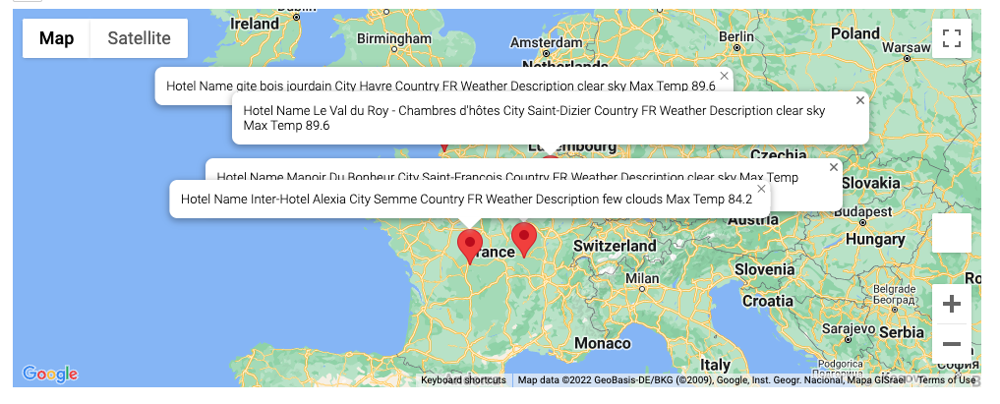

# World_Weather_Analysis
## Overview 
PLANMYTRIP is a top travel technology company that specializes in internet-related services in the hotel and lodging industry. A beta app has been created which allows users to filter their search data based on their preferred travel criteria (min-max tempretures) in order to find their ideal hotel, anywhere in the world. So far users love it, and the next iteration of the app based on their feedback is to add the weather description to the weather data output. The next steps are to: 
  1. **Retrieve Weather Data:** Generate a set of 2,000 random latitudes and longitudes, retrieve the nearest city, and perform an API call with OpenWeatherMap.org. In addition to the city weather data you gathered in this module, use the API to retrieve the current weather description for each city. Then, create a new DataFrame containing the updated weather data.
  2. **Create a Customer Travel Destinations Map:** Employ input statements to retrieve customer weather preferences. Use those preferences to identify potential travel destinations and nearby hotels. Show those destinations on a marker layer map with pop-up markers.
  3. **Create a Travel Itinerary Map:** Use the Google Directions API to create a travel itinerary that shows the route between four cities chosen from the customer’s possible travel destinations. Then, create a marker layer map with a pop-up marker for each city on the itinerary.
  
## Sample Output

